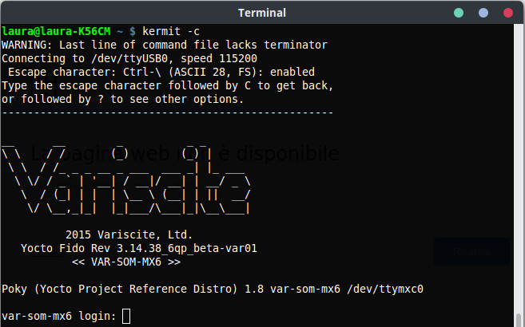

# ckermit snap

This is the Ubuntu 18.04 .deb package converted to snap, because in Ubuntu
20.04, there is no ckermit package. Just as I did with Gnash. See
https://raymii.org/s/blog/Ive_packaged_up_CKermit_as_a_snap_for_Ubuntu_20.04.html for more info on the snap, and
https://www.kermitproject.org/ for more info on kermit.

Ubuntu versions 18.04 and 21.04 currently do have ckermit in the repository, so this 
snap is only really useful on Ubuntu 20.04 LTS. (https://answers.launchpad.net/ubuntu/+source/ckermit/+question/693175)

I personally use ckermit for a few scripts that boot up ARM devkit boards via NFS. 
One such script can be found in this repository (`test.kermit`) and is what I 
use to test the snap with. Other functionality is not tested, but if you
miss anything, just contact me.

(Screenshot from here: http://www.amber-lab.com/wiki/amber-board-tutorials/board-connection-to-pc/)

To use `ckermit` on the command-line you must use the command
`ckermit-raymii`. `ckermit` is a reserved name on the snap store.

C-Kermit is a combined network and serial communication software package
offering a consistent, transport-independent,  cross-platform approach to
connection establishment, terminal sessions, file transfer, file management, 
character-set translation, numeric and alphanumeric paging, and automation of
file transfer and management,  dialogs, and communication tasks through its
built-in scripting language.  

The Kermit Project originated at Columbia University in New York City in 1981
and remained there for 30 years.  Since 2011 it is independent. 

## Setup 

In order to access a serial port over USB (ttyUSB0 for example, you need to
add your user to the `dailout` group and connect the snap to the `raw-usb`
socket.

Open a terminal window, run the following commands an *reboot* your computer.

	sudo usermod -a -G dialout $USER

	sudo snap connect ckermit-raymii:raw-usb

Now restart your computer and you're good to go!

Source URL for Kermit: https://www.kermitproject.org/

My homepage: https://raymii.org/

Snap store page: https://snapcraft.io/ckermit-raymii

Install via the snap store:

	snap install ckermit-raymii

(ckermit is a reserved name in the snap store)

Or locally, clone this git repo and install the snap:

 	sudo snap install --dangerous ckermit-raymii_9.0.302-5.3_amd64.snap

Based on this article: https://philroche.net/2020/10/08/using-snaps-to-package-old-software/

# Changelog

No new version of ckermit will come out since development stopped around 2011, this is 
the changelog of the snap.

## 9.0.302-5.3

- Original ckermit package from 18.04 snapped up
